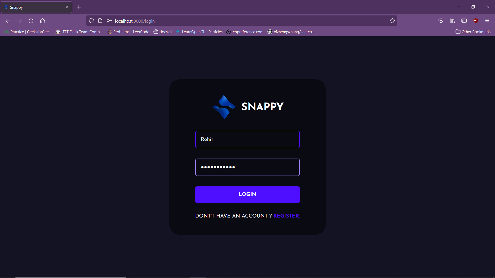
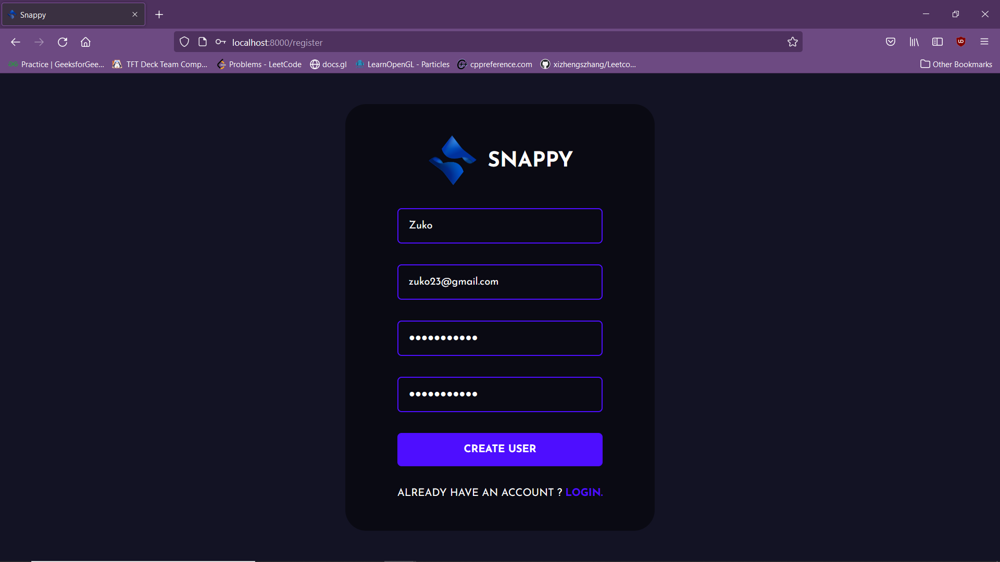
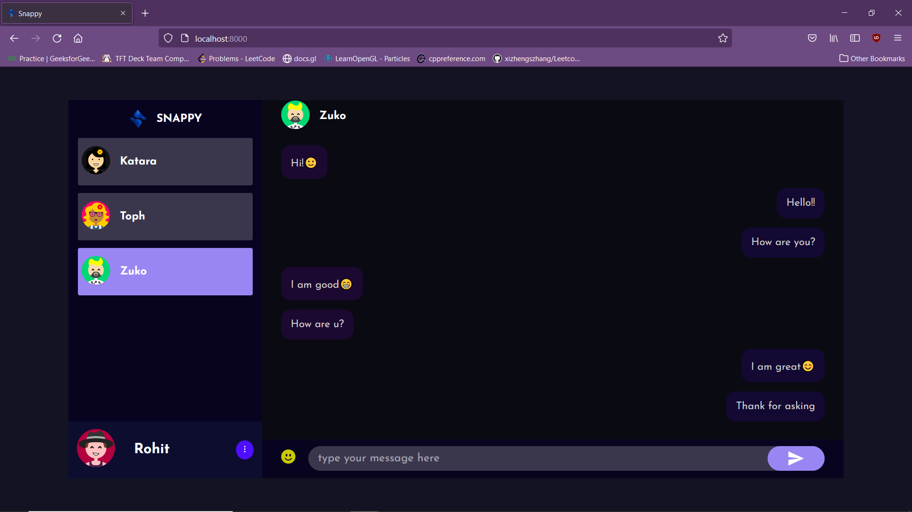
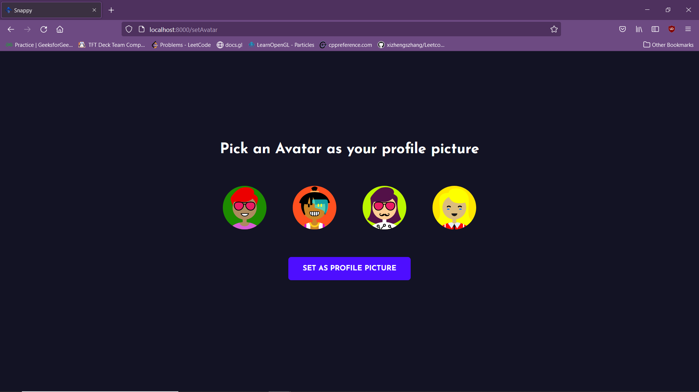

# Chat-App

## Running the Project
1. In the terminal, run: `npm install`
1. Then, run: `npm run deploy`
2. Browse to the chat app frontend at [localhost:8000](http://localhost:8000) and chat with your friends!

## Project Overview

### 1. Login Screen

### 2. Register Screen

### 3. Chat Screen

### 4. Set Avatar Screen

